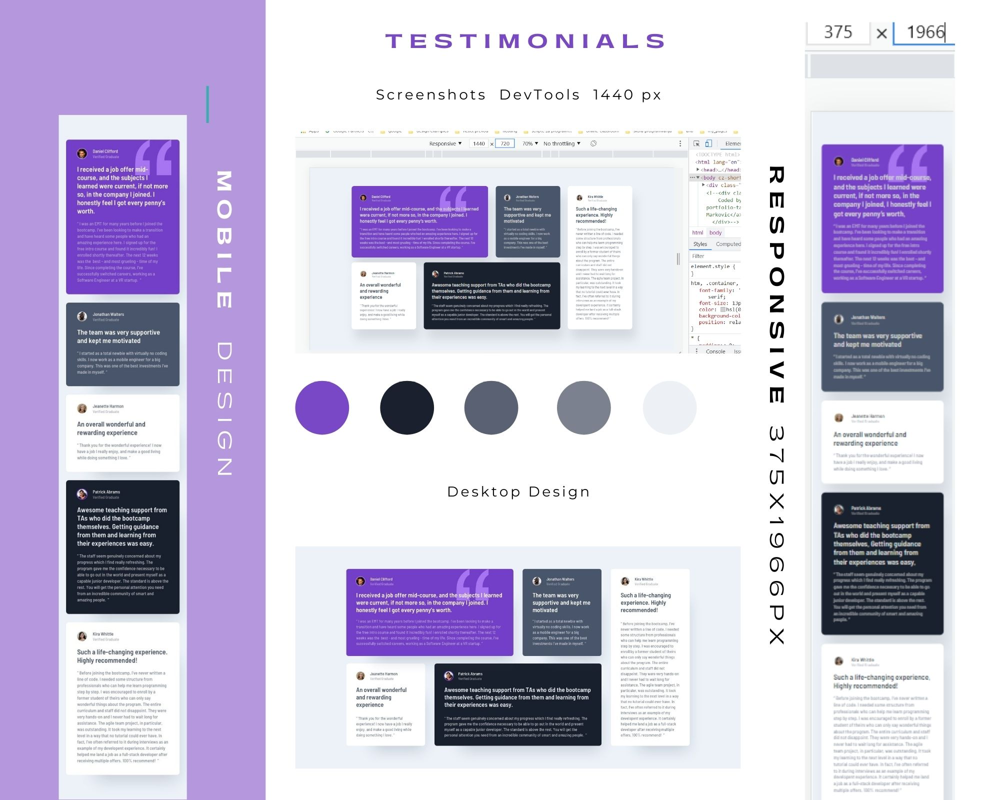
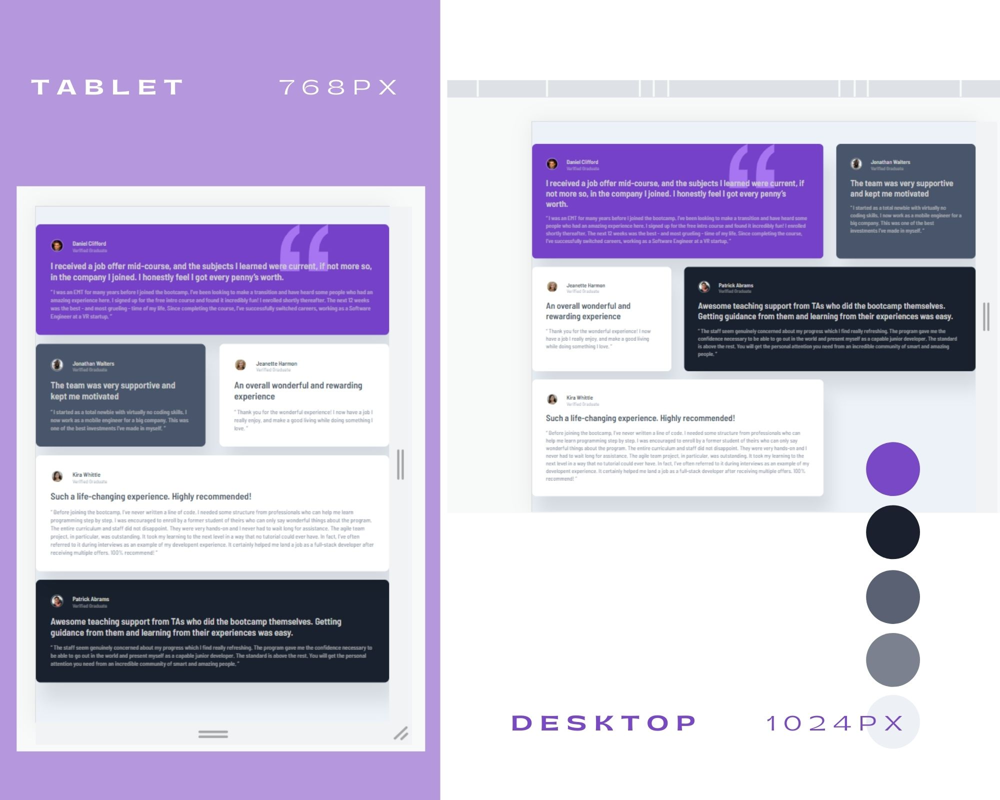
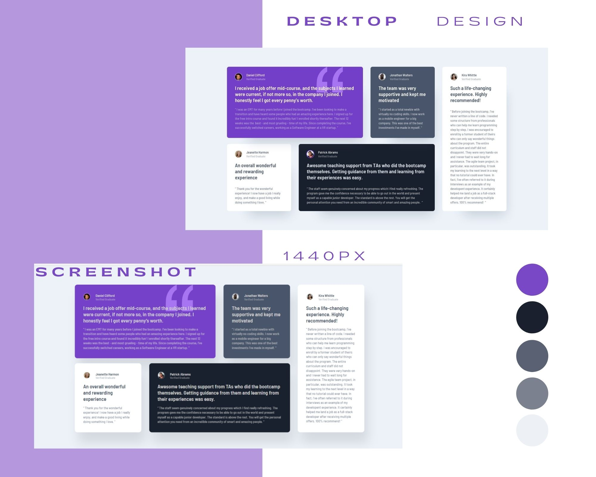
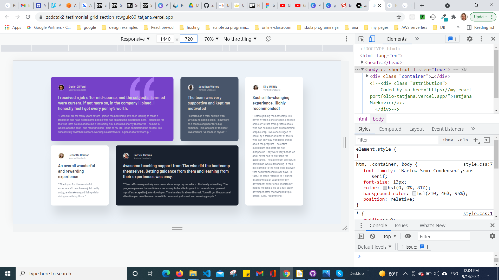
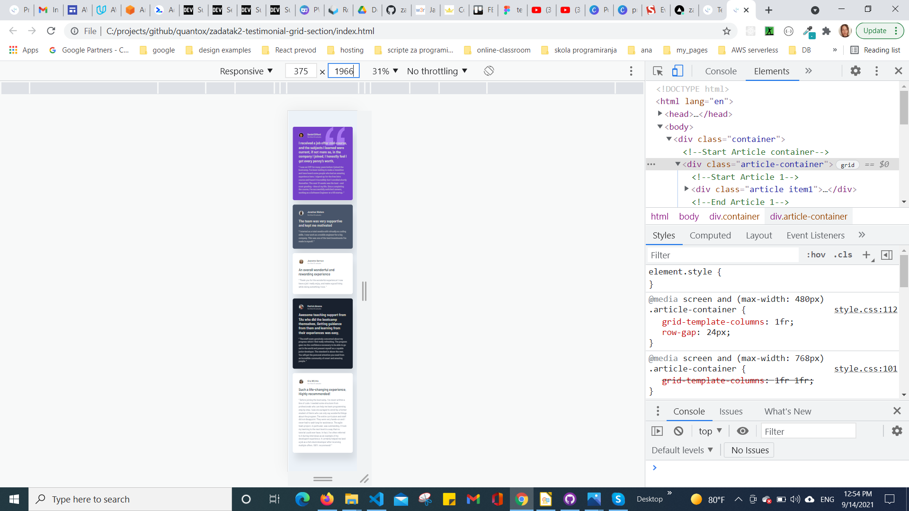
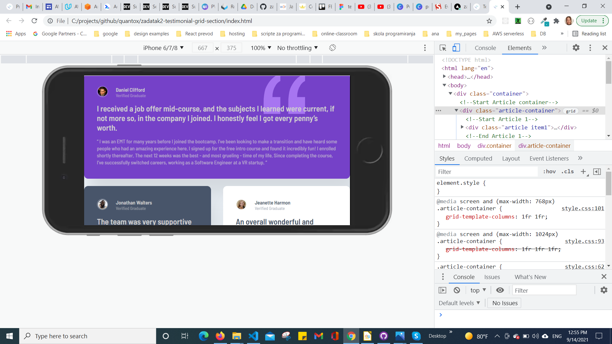
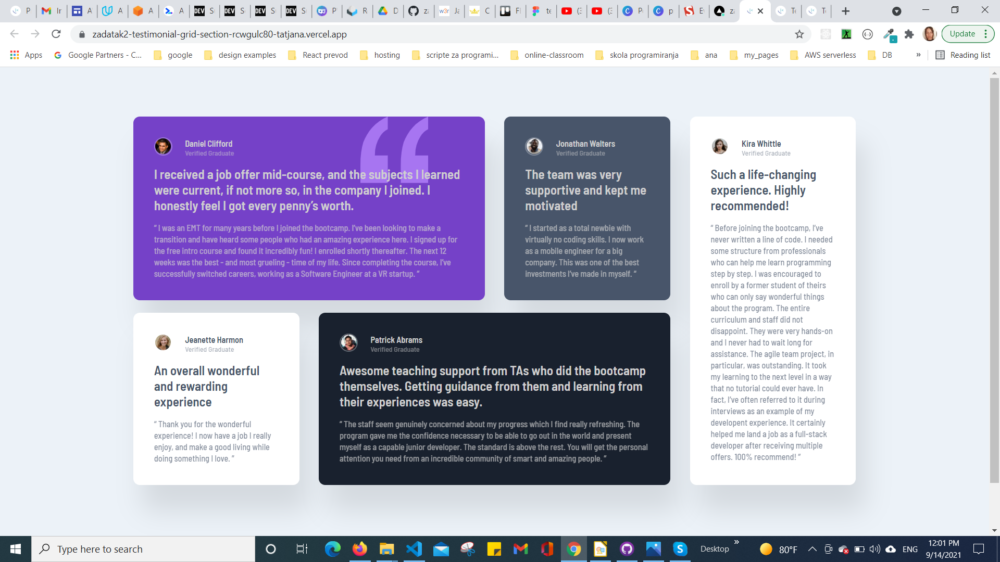

# Testimonials grid section solution

## Table of contents

  - [Overview](#overview)
  - [The challenge](#the-challenge)
  - [Screenshot](#screenshot)
  - [Links](#links)
  - [My process](#my-process)
  - [Built with](#built-with)
  - [Author](#author)
## Overview

### The challenge

Users should be able to:

- View the optimal layout for the site depending on their device's screen size

### Screenshot

on.**

### Links

-  [Solution URL:](https://github.com/tatjama/zadatak2-testimonial-grid-section)
-  [Live Site URL:](https://vercel.com/tatjana/zadatak2-testimonial-grid-section)

## My process

1. Create a new project 
2. Import starting code 
3. Initializing git repositories main and development
4. Import git repositories to the Vercel project
5. Create HTML structure
6. Import fonts to styles 
7. Use Figma design tools for measurements
8. Create CSS Utility
9. Article padding, margin, font-size...
10. CSS Grid
11. Style colors: text, background, borders, shadows
13. Responsive breakpoints at 1024px, 768px, 480px
14. Compare original designs with my work
15. Create screenshots
16. Change README-template.md to README.md 
17. Merge develop branch into master branch

### Built with

- Semantic HTML5 markup
- CSS Grid
- Media queries
- Centering elements, content and text
- Background Image
- Element positioning
- Box-shadows
- Customize font,width and size
- Borders
- Transparency

## Author

- Website - [Tatjana Markovic](https://my-react-portfolio-tatjana.vercel.app/)
- LinkedIn - [Tatjana Marković](https://www.linkedin.com/in/tatjana-markovi%C4%87-919501189/)
- GitHub - [tatjama](https://github.com/tatjama)

